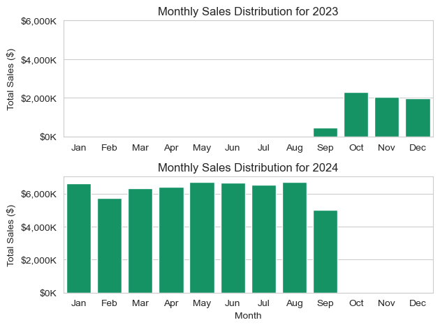
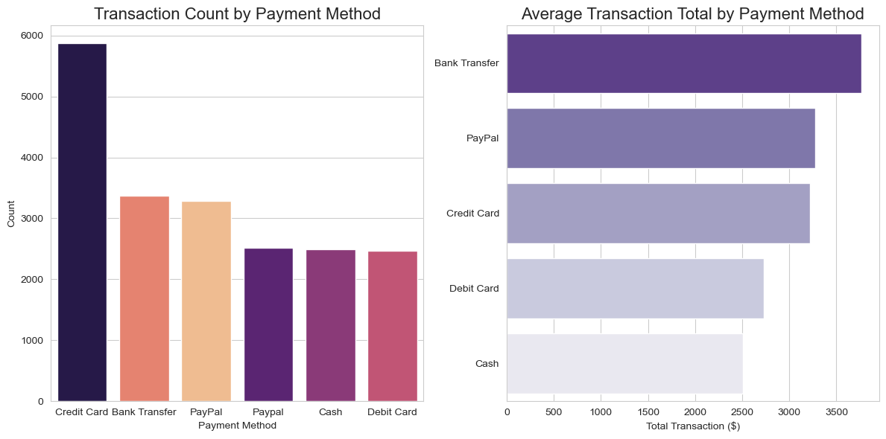
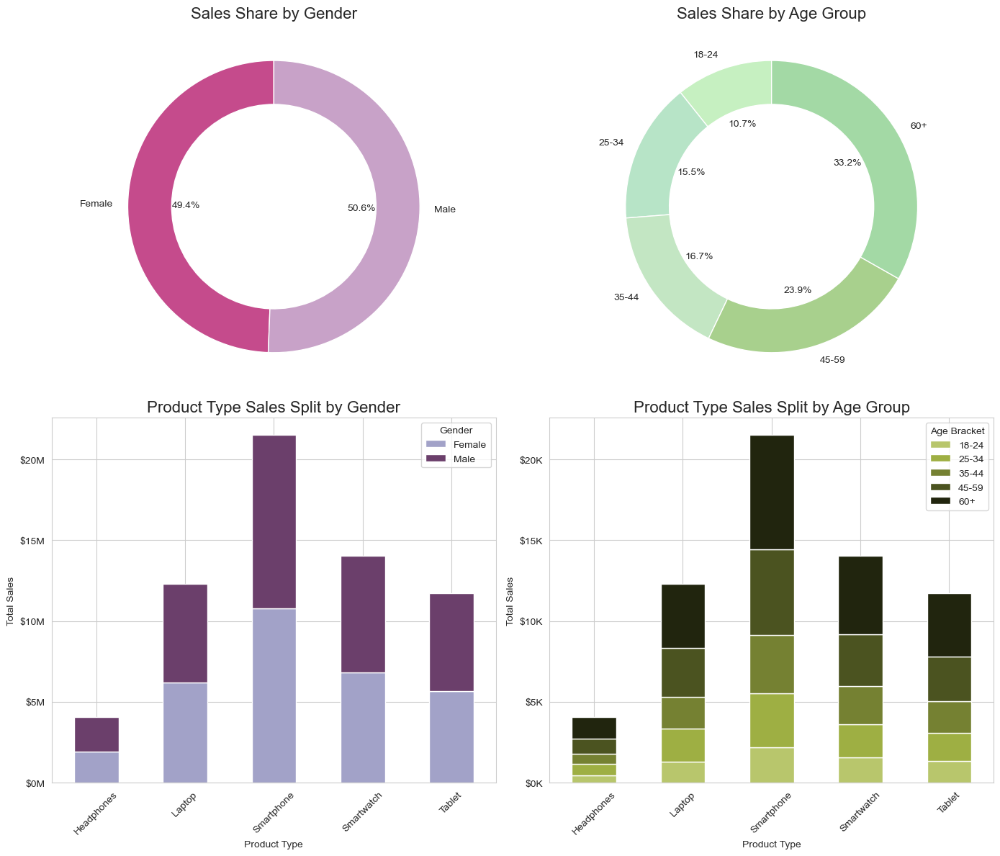
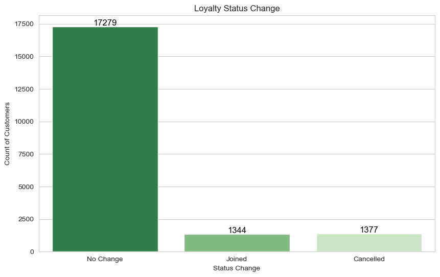
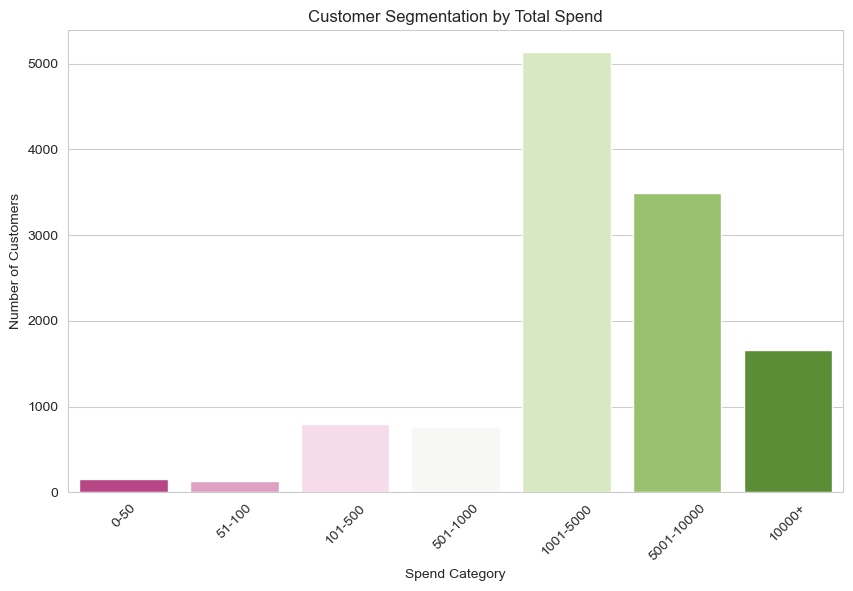
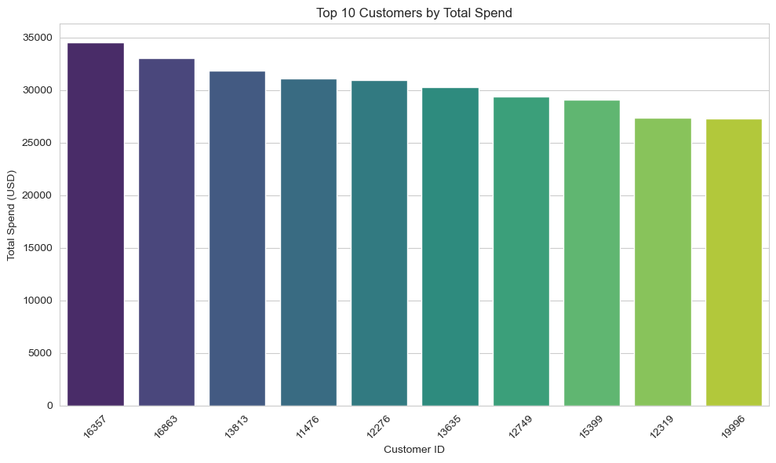

# Exploring Customer Trends and Preferences in Electronics Sales
## Overview
This project analyzes customer purchase behavior and trends within the electronics sales industry. The data, covering transactions from September 2023 to September 2024, includes diverse customer demographics, product preferences, payment methods, and transaction details. Through data cleaning, feature engineering, and visualization, the analysis aims to uncover insights into customer spending habits, loyalty trends, and the overall sales distribution across various segments.

## Key Questions
1. What are the monthly sales trends in 2023 and 2024?
2. Which payment methods are most frequently used and which yield the highest average transaction value?
3. How does customer spending vary by demographics, such as age group and gender?
4. What is the distribution of customer loyalty status changes (e.g., new loyalty members vs. cancellations)?
5. How are customers segmented based on their total spending, and who are the top 10 customers by total spend?

## Tools and Libraries Used
* __Python Libraries:__ Pandas, NumPy, Matplotlib, Seaborn
* __Data Cleaning and Transformation:__ Used Pandas for handling missing data, duplicates, and standardizing text
* __Data Visualization:__ Seaborn and Matplotlib for creating various visualizations, including bar charts, pie charts, and stacked bar charts

## Data Preparation and Feature Engineering
1. Data Cleaning: Removed duplicates and rows with missing values in key columns; converted date formats for consistency.
2. Date Features: Extracted purchase month and year for sales analysis by time.
3. Customer Segmentation: Binned customer age and total spend into categories to allow for targeted demographic analysis.
4. Loyalty Status Tracking: Added columns to capture changes in customer loyalty status, providing insights into trends in membership engagement.

## Visualizations and Insights

1.__Monthly Sales Trends:__ Sales were analyzed monthly for 2023 and 2024, with visualizations showing fluctuations and peak months, indicating seasonal trends.

Insights:
* Sales in 2024 are much higher than in 2023, reflecting a full year of sales versus the partial year in 2023.
* The stability of monthly sales in 2024 shows growth and maturation of the business or increased customer engagement.

2.__Payment Method Analysis:__ Payment methods were analyzed by transaction count and average transaction total. PayPal and Credit Card usage dominated, with Credit Card showing higher average transaction totals.

Insights:
* Transaction Count by Payment Method:
    * The majority of transactions were made using Credit Card, with nearly 6,000 transactions. This makes Credit Card the most popular payment method by a significant margin.
    * Bank Transfer and PayPal are the next most common payment methods, with around 3,000 transactions each.
    * Cash and Debit Card have the lowest transaction counts, indicating they are less preferred by customers.
* Average Transaction Total by Payment Method:
    * Bank Transfer has the highest average transaction amount, suggesting that customers who use Bank Transfer may be making larger purchases.
    * PayPal and Credit Card follow in terms of average transaction total, which aligns with their popularity in terms of transaction count.
    * Cash has the lowest average transaction amount, which could imply that cash transactions are typically for smaller purchases.

3.__Sales Distribution by Demographics:__ Sales share was analyzed by gender and age group. Key insights include age brackets with higher spending and gender-based purchase behavior patterns.

Insights:
* There is a balanced gender distribution in sales, but a skewed age distribution, with older age groups (45+) dominating sales. This could guide marketing strategies to focus more on older demographics.
* The high sales of smartphones and laptops suggest these are primary products of interest, especially among male customers and older age groups. Tailoring product recommendations and promotions for these demographics could further increase sales.

4.__Loyalty Status Changes:__ Visualization showed customer movement in and out of loyalty programs, with the majority showing stable loyalty or “no change.”

Insights:
* Retention: The high number of customers who experienced no change in their status suggests a strong customer retention rate. This indicates that the loyalty program is effective in keeping existing customers engaged.
* Acquisition: While the number of customers who joined the program is lower than those who remained unchanged, it still represents a significant acquisition of new loyal customers. This highlights the program's ability to attract new members.
* Cancellation: The number of cancellations is relatively low compared to the other categories, suggesting that the program is not experiencing a high churn rate. This indicates that the program is providing value to its members and meeting their needs.

5.__Customer Segmentation by Spend:__ Customers were segmented based on total spending, revealing patterns such as high-value customer tiers. This segmentation helped identify customer groups contributing the most to sales, allowing for more focused marketing and retention strategies.

Insights:

* The lower number of customers (around 150) fall into the lowest spend category (0-50).
* Majority of customers spend around between $1000 and $5000.

6.__Top 10 Customers:__ A separate visualization highlights the top 10 customers based on their total spending. These high-value customers represent a significant portion of the overall revenue, underscoring the impact of individual loyalty and purchasing power.

Insights:
* Spending Patterns: These customers tend to make larger, less frequent purchases or have a high frequency of moderate-value transactions, suggesting varied behavior within this top tier.
* Loyalty Program Enrollment: Many of the top customers are enrolled in the loyalty program, indicating that loyalty initiatives may contribute to sustaining high spenders.
* Demographic Profile: Commonalities among these top 10 customers, such as age and gender distribution, could provide guidance for targeted marketing strategies aimed at retaining and engaging similar profiles.

## What I Learned
__Data Preparation Techniques:__ Enhanced skills in data cleaning and feature engineering.
__Advanced Visualization:__ Gained experience in creating complex visualizations and formatting for better interpretability.
__Customer Behavior Analysis:__ Learned to identify and analyze customer segments and spending trends.

## Conclusion
This project demonstrates the potential for using data to understand customer purchasing behavior and preferences in the electronics sector. By identifying key segments and patterns, businesses can better cater to customer needs, create targeted marketing campaigns, and improve loyalty strategies.

